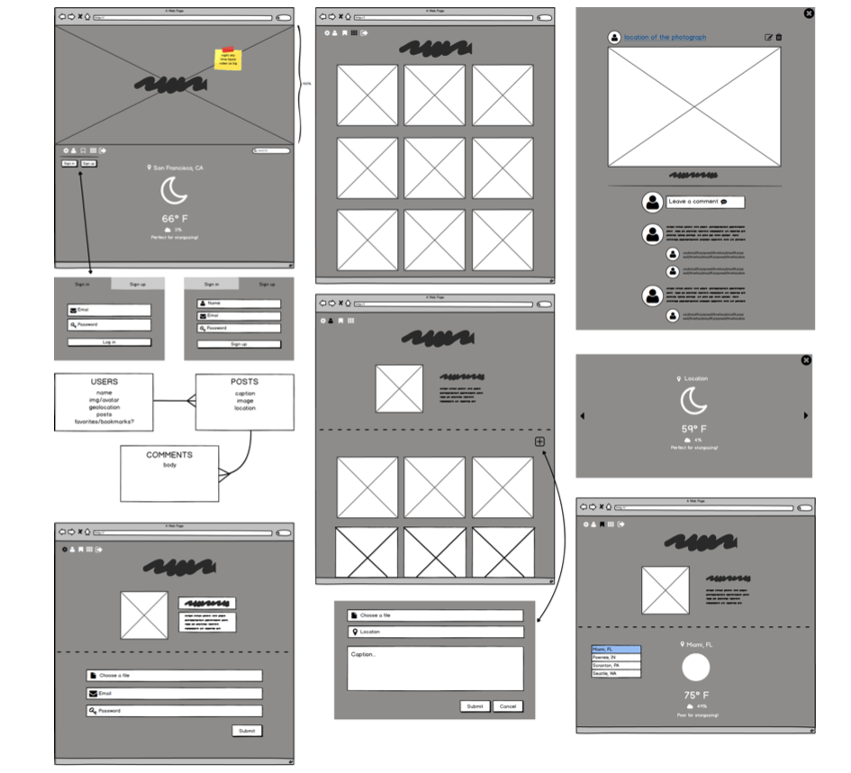

# Stellar
This is an app built for stargazing lovers! Users will not only be able to search for today's forecast, but also share their astrophotography.

## Wireframe & ERD

## Installation
`brew install imagemagick` 
`bundle` install all the Ruby Gems used

### Tools Used
* [imagemagick](https://www.npmjs.com/package/imagemagick)
* [AccuWeather API](http://developer.accuweather.com/)
* [YouTube Video](https://www.youtube.com/watch?v=PrrHve14fAA)

### Ruby Gems Used
* [bcrypt](https://gist.github.com/thebucknerlife/10090014)
* [paperclip](https://github.com/thoughtbot/paperclip)
* [paperclip-cloudinary](https://github.com/GoGoCarl/paperclip-cloudinary)
* [HTTParty](https://github.com/jnunemaker/httparty)
* [semantic-ui-sass](https://github.com/doabit/semantic-ui-sass)
* [figaro](https://github.com/laserlemon/figaro)
* [acts_as_commentable_with_threading](https://github.com/elight/acts_as_commentable_with_threading)

### Usage
1. `rails db:migrate`
2. `rails s`
3. localhost:3000

## Technologies Used
* HTML
* CSS
* JavaScript
* Ruby on Rails
* jQuery
* Semantic-ui
* PostgreSQL
* Photoshop

## Existing Features
* Weather forecast using user's geolocation and search
* CRUD
* RESTful API/ External API
* User Authentication and Authorization
* Image preview before upload

## Future Features
* Share posts to social media
* Mailing system for astronomy news and forecasts
* Implement bookmarks / likes / follow for users
* Implement light pollution map of some sort

### Bugs to fix
* Can not fetch weather forecast for some of the posted entry locations
* Can not toggle individual reply text area

## Demo

### Heroku
[Check it out here!](https://s-t-e-l-l-a-r.herokuapp.com/)

### Demo Log-in
Account: b@b.com  
Password: 123456
